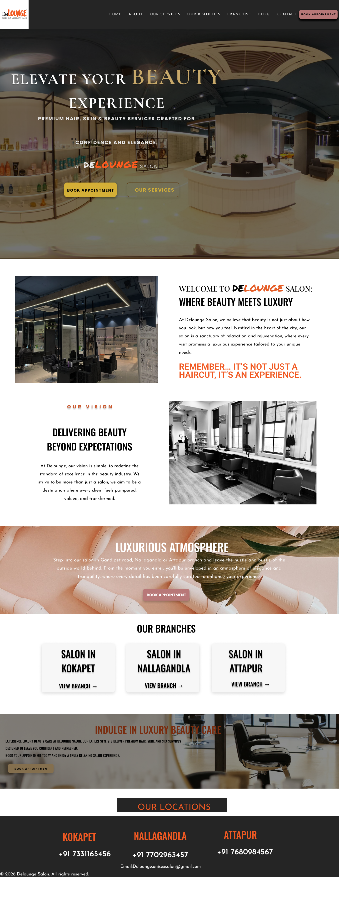
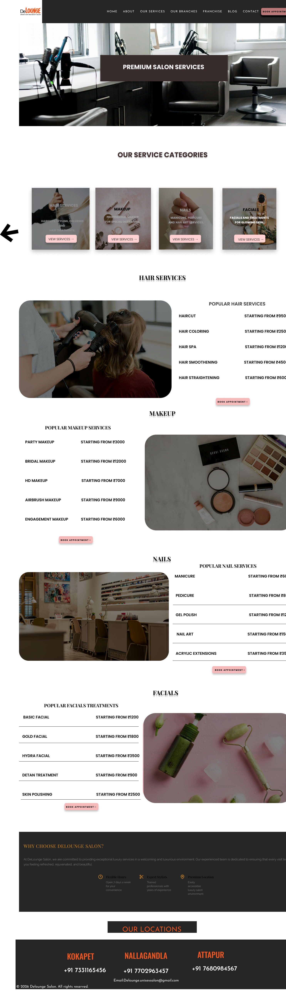
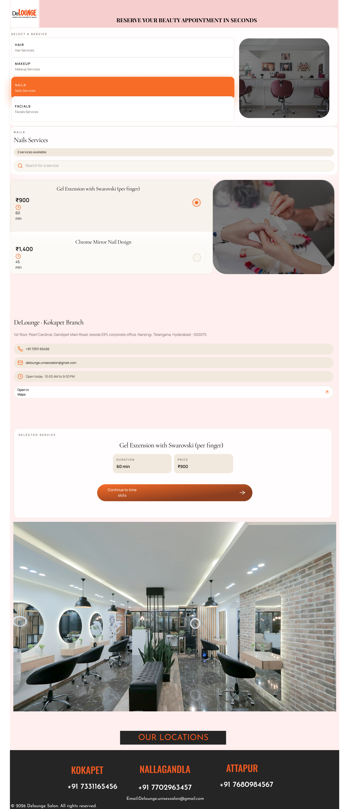
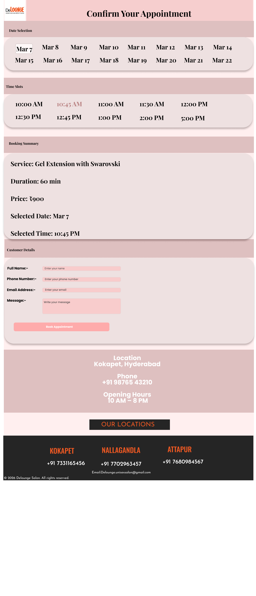

# FUTURE_UX_01

UI/UX Internship – Future Interns

## Task 1: Local Service Business Website Redesign

### Objective
Redesign a local service business website with a strong focus on lead generation and conversion optimization.

---

### Tools Used
- Figma
- GitHub

---

### Project Deliverables
- Homepage Design
- Service Page Design
- Contact / Lead Page
- UX Design Rationale

---

## Intern Details
Name: Abhigna Reddy  
Track: UI/UX Design  
CIN: FIT/FEB26/UX1635  

---

## Internship Duration
18 February 2026 – 18 March 2026

---

## Design Rationale

### Target Users
The primary users are customers looking for salon services who want a simple way to explore available services and book appointments online quickly.

### Layout Structure
The redesigned website follows a clear flow: Homepage → Service Categories → Booking → Confirmation. This structure helps users easily navigate the website and complete bookings without confusion.

### UX Decisions
Services are organized into categories such as Hair, Makeup, Nails, and Facials. Important information like service price and duration is clearly displayed. A step-by-step booking process guides users through selecting services, choosing time slots, and confirming appointments.

### Conversion Improvements
The redesign highlights clear **Book Appointment** call-to-action buttons and improves service discovery. These changes make it easier for users to complete bookings and improve the overall user experience.

---

## Figma Prototype

You can view the interactive prototype here:

https://www.figma.com/proto/5xIafjAGzuDg9n4n3C4YvS/ui-ux-task-1

---

## Design Screenshots

### Homepage

### Service Page

### Booking Page

### Lead Page

---
## Case Study PDF

You can view the full UI/UX case study here:

[View the UX Case Study](casestudy1.pdf)
